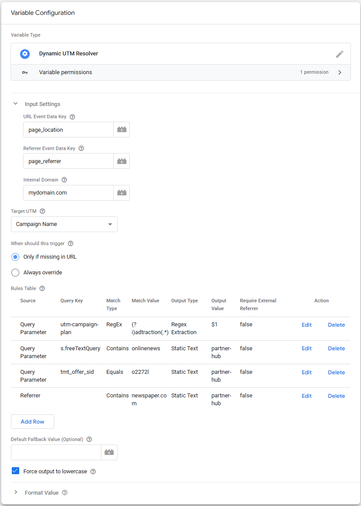
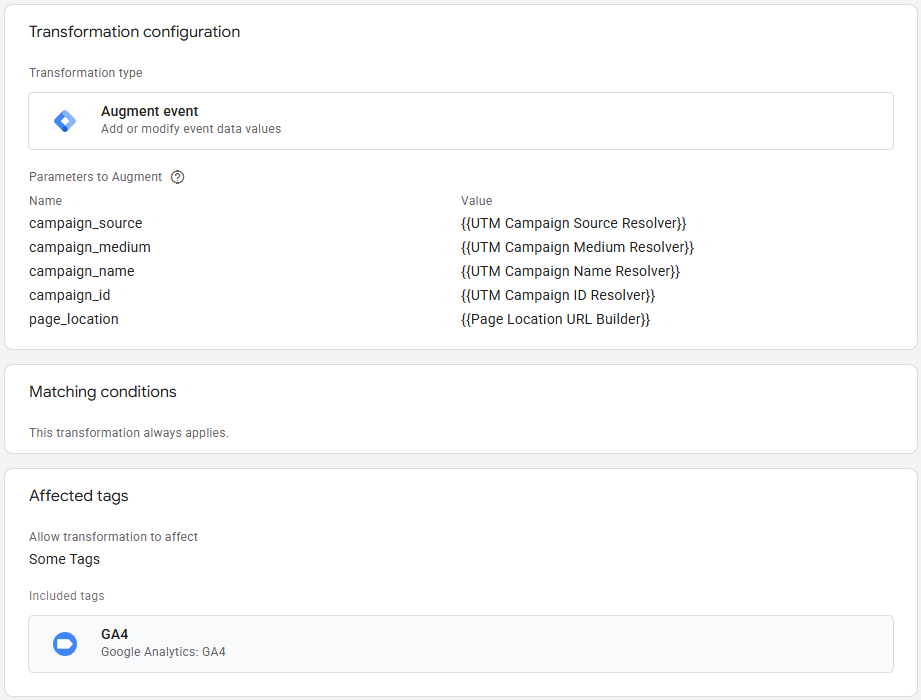
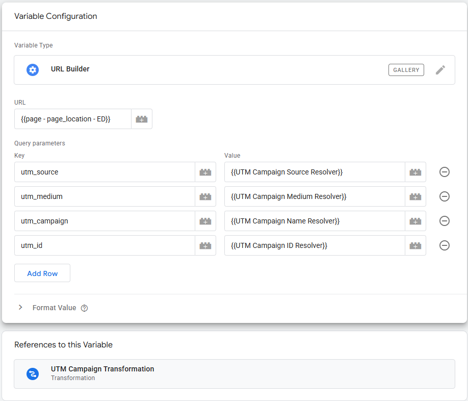

# Dynamic UTM Resolver - SGTM Variable (Server)

A Server-Side Google Tag Manager (sGTM) Variable Template to dynamically fix, map, and resolve UTM parameters based on Referrers or Query Parameters.

## The Problem it Solves
Clean attribution in Google Analytics 4 (GA4) requires consistent UTM tagging, but real-world traffic is messy:
* **Missing UTMs:** Users arrive via affiliates, social media, or partner sites without proper tagging.
* **Proprietary IDs:** Traffic is driven by affiliate links or ad networks using custom parameters (e.g., `at_gd=123`) instead of standard UTMs.
* **Inconsistent Casing:** Campaigns sent with `utm_medium=Social` and `utm_medium=social` fragment GA4 reports.
* **Hardcoded Fallbacks:** Relying on simple Lookup Tables in GTM is rigid and lacks dynamic extraction capabilities.

## Features
* **Referrer & Query Matching:** Evaluate incoming traffic based on referring domains or specific URL parameters.
* **Dynamic RegEx Extraction:** Use capture groups (e.g., `$1`) to extract dynamic IDs from query strings and map them directly to UTMs.
* **Behavior Control:** Choose to preserve existing UTMs ("Only if missing in URL") or force corrections ("Always override").
* **Force Lowercase:** Automatically clean up capitalization to prevent report fragmentation (can be disabled for case-sensitive IDs).
* **Custom Fallbacks:** Define a default output if no rules match and the UTM is missing.

---

## ⚙️ Configuration & Setup

### 1. Create the Variable
Import the [`template.tpl`](template.tpl) file into your sGTM workspace under **Templates > New Variable Template**. 

Create a new Variable using the template for each UTM parameter you want to resolve (e.g., one for Source, one for Medium, one for Campaign ID).

### 2. Define the Rules Table
The template evaluates rules from top to bottom and stops at the first match.

* **Source:** Select `Referrer` or `Query Parameter`.
* **Query Key:** The URL parameter to check (leave blank for Referrer).
* **Match Type / Value:** Use `Equals`, `Contains`, or `RegEx`. *(Note: For referrers, modern browsers often drop the path. Use `Contains` and match the root domain, e.g., `facebook.com`).*
* **Output Type:** Choose `Static Text` or `Regex Extraction`. 
* **Output Value:** The value to return. If using Regex Extraction, use capture groups like `$1`.

### 3. Apply Campaign via sGTM Transformation (Recommended)
To apply your resolved UTMs to GA4 (and any other tags), map them using an **Augment Event** Transformation.

**Important:** When sending campaign parameters via sGTM Event Data, you must use the `campaign_` prefix instead of `utm_`.

Create an Augment Event Transformation with the following parameters:
* `campaign_source` -> `{{Your Source Variable}}`
* `campaign_medium` -> `{{Your Medium Variable}}`
* `campaign_name` -> `{{Your Campaign Variable}}`
* `campaign_id` -> `{{Your Campaign ID Variable}}`

---

## 4. Apply UTM via Page Location rewrite and sGTM Transformation

It's also possible to rewrite **Page Location**, and add resolved UTM's as parameters to the URL.

### Setup using the Stape URL Builder
Rather than building a custom script, you can use the community-trusted [Stape URL Builder Variable Template](https://github.com/stape-io/url-builder-variable).

1. Add the Stape URL Builder template to your workspace.
2. Create a new Stape URL Builder variable.
3. Set the **Base URL** to the native `page_location` event data variable.
4. Under **Queries**, add your extended UTMs. Set the Query Name to the exact UTM key (e.g., `utm_source`) and the Value to your Dynamic UTM Resolver variable.

5. Finally, go back to your **Augment Event Transformation** (or directly inside your GA4 tag) and override `page_location`:
* **Name:** `page_location` 
* **Value:** `{{Your Stape URL Builder Variable}}`

The GA4 tag will now send the modified URL containing your dynamically resolved extended UTMs, ensuring improved attribution in your reports.

## Official Google Documentation
The formatting logic in this template is built strictly alongside the official developer documentation. Bookmark these for reference on campaign tagging:

* [Google Analytics Configuration Campaign reference](https://developers.google.com/analytics/devguides/collection/ga4/reference/config)
* [URL builders: Collect campaign data with custom URLs](https://support.google.com/analytics/answer/10917952)

Solution by [**Knowit AI & Analytics**](https://www.knowit.no/) (Oslo, Norway). Not officially supported by Knowit.
